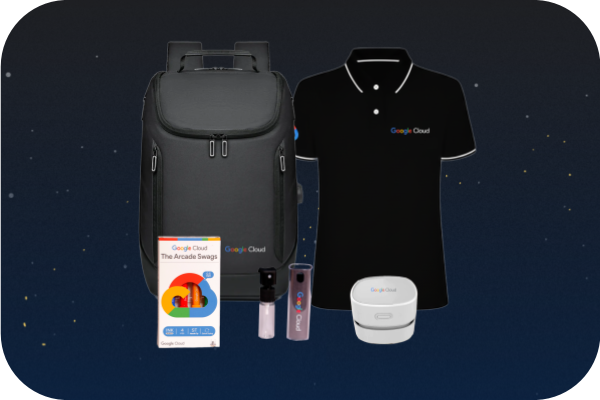
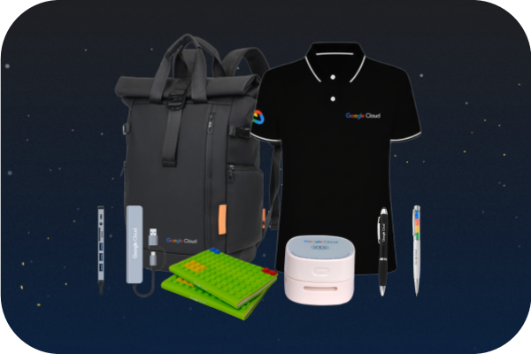
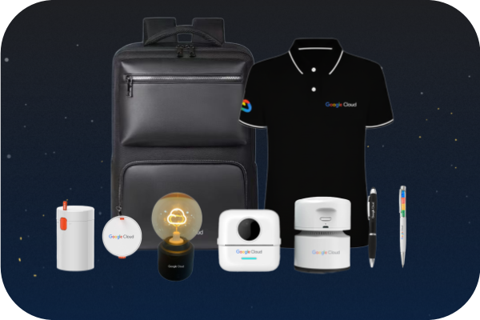

# Google Cloud Challenge Lab Solutions - Latest 2025 🚀

<div ├── 📂 1-Beginner: Get Started with Google Cloud/
│   ├── 📂 Challenge Lab Solutions/
│   │   ├── 📂 1-The Basics-of-Google-Cloud-Compute-Challenge-Lab/
│   │   │   ├── � Pro/
│   │   │   │   ├── �📄 GUI-Solution.md (Step-by-step console guide)
│   │   │   │   ├── 📄 CLI-Solution.md (Command-line approach)
│   │   │   │   └── 📄 Automation-Solution.md (Scripts & IaC)
│   │   │   ├── � Challenge-Lab-specific-solution.md
│   │   │   └── 📄 README.md
│   │   ├── �📂 2-Get-Started-with-Pub-Sub-Challenge-Lab/
│   │   │   ├── 📂 Pro/
│   │   │   │   ├── 📄 GUI-Solution.md (Messaging with console)
│   │   │   │   ├── 📄 CLI-Solution.md (gcloud commands)
│   │   │   │   └── 📄 Automation-Solution.md (Complete automation)
│   │   │   ├── 📄 Challenge-Lab-specific-solution.md
│   │   │   ├── 📄 solution.md
│   │   │   └── 📄 README.md
│   │   ├── 📂 3-Getting-Started-with-API-Gateway-Challenge-Lab/
│   │   │   ├── 📂 Pro/
│   │   │   │   ├── 📄 GUI-Solution.md (API Gateway & Cloud Run)
│   │   │   │   ├── 📄 CLI-Solution.md (CLI deployment)
│   │   │   │   └── 📄 Automation-Solution.md (Terraform & scripts)
│   │   │   ├── 📄 Challenge-Lab-specific-solution.md
│   │   │   └── 📄 README.md
│   │   ├── 📂 4-Get-Started-with-Dataplex-Challenge-Lab/
│   │   │   ├── � Pro/
│   │   │   │   ├── �📄 GUI-Solution.md (Data lake console setup)
│   │   │   │   ├── 📄 CLI-Solution.md (gcloud dataplex commands)
│   │   │   │   └── 📄 Automation-Solution.md (Automated data lake)
│   │   │   ├── � Challenge-Lab-specific-solution.md
│   │   │   └── 📄 README.md
│   │   ├── �📂 5-Get-Started-with-Looker-Challenge-Lab/
│   │   │   ├── � Pro/
│   │   │   │   ├── �📄 GUI-Solution.md (BI dashboard creation)
│   │   │   │   ├── 📄 CLI-Solution.md (Looker API & CLI)
│   │   │   │   └── 📄 Automation-Solution.md (LookML automation)
│   │   │   ├── 📄 Challenge-Lab-specific-solution.md
│   │   │   └── 📄 README.md
│   │   └── 📄 README.md
│   ├── 📂 Lab Free Courses Answer Key/
│   │   └── 📄 README.md (Free course solutions)
│   └── 📄 README.mdr">

GOOGLE CLOUD ARCADE Facilitator '25 (Cohort 2) [🔗link](https://rsvp.withgoogle.com/events/arcade-facilitator) | [ARCADE](https://go.cloudskillsboost.google/arcade?utm_source=qwiklabs&utm_medium=gametemplate&utm_campaign=arcade25-july&_gl=1*z9tmyw*_ga*Nzc1OTI4MDg3LjE3NTQzMDgzNjk.*_ga_2X30ZRBDSG*czE3NTUzMjAyOTIkbzUkZzEkdDE3NTUzMjAzNTEkajEkbDAkaDA.)

</div>

---
## 👨‍💻 About CodeWithGarry

### **Your Trusted Google Cloud Solutions Architect**

<div align="center">

[](https://github.com/codewithgarry)
[](https://youtube.com/@codewithgarry)
[](https://linkedin.com/in/codewithgarry)

</div>


---

<div align="center">

## 🏆 Google Cloud Arcade Prizes & Rewards

### **🎁 Exclusive Prize Collections**

*Complete arcade challenges and earn amazing Google Cloud swag!*

<table>
<tr>
<td align="center">

<br><b>🎯 Level 1 Collection</b>
<br>Backpack, Polo Shirt, Database Guide
</td>
<td align="center">

<br><b>🔥 Level 2 Collection</b>
<br>Travel Bag, Polo, Notebooks, Pens
</td>
<td align="center">

<br><b>⚡ Level 3 Collection</b>
<br>Premium Bag, Certificates, Tech Swag
</td>
</tr>
</table>

**🏆 Start your journey and collect all the amazing Google Cloud prizes!**

</div>

---

## 📁 GOOGLE CLOUD ARCADE Facilitator '25 Solutions

```
📦 Google-Cloud-Challenge-Lab-Solutions-Latest/
├── 📂 1-Beginner: Get Started with Google Cloud/
│   ├── 📂 1-The Basics-of-Google-Cloud-Compute-Challenge-Lab/
│   │   └── 📄 solution.md (GUI→CLI→Automation)
│   ├── 📂 2-Get-Started-with-Pub-Sub-Challenge-Lab/
│   │   └── 📄 solution.md (Complete messaging solution)
│   ├── 📂 3-Getting-Started-with-API-Gateway-Challenge-Lab/
│   │   └── 📄 solution.md (API management & Cloud Run)
│   ├── 📂 4-Get-Started-with-Dataplex-Challenge-Lab/
│   │   └── 📄 solution.md (Data lake management)
│   ├── 📂 5-Get-Started-with-Looker-Challenge-Lab/
│   │   └── 📄 solution.md (Business intelligence & analytics)
│   └── � README.md
├── 📂 2-Intermediate: Dive Deeper into Google Cloud/
│   └── 📄 README.md
├── 📂 3-Advanced: Take Your Google Cloud Skill to Next Level/
│   └── 📄 README.md
├── � Aug-2025/
│   └── 📄 README.md (August arcade solutions)
├── 📂 Sept-2025/
│   └── 📄 README.md (September arcade solutions)
├── 📂 images/
│   ├── 📄 1.png (Level 1 prizes)
│   ├── 📄 2.png (Level 2 prizes)
│   └── 📄 3.png (Level 3 prizes)
├── �📄 .gitignore
├── 📄 AUTHOR.md (CodeWithGarry Profile)
├── 📄 CONTRIBUTING.md (Community Guidelines)
└── 📄 README.md
```

---

<div align="cemter">

</div>

# August Solutions

## 🎮 Trivia August 2025

### 🧠 **Trivia Lab Expert Solutions**

#### **August 2025 Week 1 - Trivia** 
**Join Link**: [🎯Join Week 1](https://www.cloudskillsboost.google/games/6397?utm_source=qwiklabs&utm_medium=lp&utm_campaign=arcade25-Aug-trivia) | **Access code**: `1q-trivia-2050` | Arcade points: 1

| Lab ID | Lab Name | Lab Link | Video Tutorial |
|--------|----------|----------|----------------|
| GSP929 | Conversational Agents: Managing Environments | [🔗 Lab](https://www.cloudskillsboost.google/games/6397/labs/40303){:target="_blank"} | [🎥 Watch](https://youtu.be/F36dGDiFRH0){:target="_blank"} |
| GSP933 | Getting Started with Liquid to Customize the Looker User Experience | [🔗 Lab](https://www.cloudskillsboost.google/games/6397/labs/40304){:target="_blank"} | [🎥 Watch](https://youtu.be/-J_Ce47Qr6s){:target="_blank"} |
| GSP1211 | A Tour of Cloud Networking | [🔗 Lab](https://youtu.be/ZeQWFknRfNg){:target="_blank"} | [🎥 Watch](https://youtu.be/ZeQWFknRfNg){:target="_blank"} |
| Quiz | Skills Boost Arcade Trivia August 2025 Week 1 | [🔗 Lab](https://www.cloudskillsboost.google/games/6397/labs/40306){:target="_blank"} | [🎥 Watch](https://youtu.be/-K9BgpkEiXE){:target="_blank"} |

#### **August 2025 Week 2 - Trivia**
**Join Link**: [🎯Join Week 2](https://www.cloudskillsboost.google/games/6398?utm_source=qwiklabs&utm_medium=lp&utm_campaign=arcade25-Aug-trivia) | **Access code**: `1q-trivia-7310` | Arcade points: 1

| Lab ID | Lab Name | Lab Link | Video Tutorial |
|--------|----------|----------|----------------|
| GSP1226 | Build an LLM and RAG-based Chat Application using AlloyDB and LangChain | [🔗 Lab](https://www.cloudskillsboost.google/games/6398/labs/40309) | [🎥 Watch](https://youtu.be/1oBCO3a1STA) |
| GSP207 | Dataflow: Qwik Start - Python | [🔗 Lab](https://www.cloudskillsboost.google/games/6398/labs/40310) | [🎥 Watch](https://youtu.be/lx7RkrF6aRc) |
| GSP156 | Terraform Fundamentals | [🔗 Lab](https://www.cloudskillsboost.google/games/6398/labs/40311) | [🎥 Watch](https://youtu.be/8PPMke_dJo8) |
| Quiz | Skills Boost Arcade Trivia August 2025 Week 2 | [🔗 Lab](https://www.cloudskillsboost.google/games/6398/labs/40312) | [🎥 Watch](https://youtu.be/nuu2zOISH8s) |

#### **August 2025 Week 3 - Trivia**
**Join Link**: [🎯Join Week 3](https://www.cloudskillsboost.google/games/6399?utm_source=qwiklabs&utm_medium=lp&utm_campaign=arcade25-Aug-trivia) | **Access code**: `1q-trivia-2290` | Arcade points: 1

| Lab ID | Lab Name | Lab Link | Video Tutorial |
|--------|----------|----------|----------------|
| GSP157 | Creating Cross-region Load Balancing | [🔗 Lab](https://www.cloudskillsboost.google/arcade) | [🎥 Watch](https://youtu.be/wc4AWw_zvks) |
| GSP182 | Distributed Load Testing Using Kubernetes | [🔗 Lab](https://www.cloudskillsboost.google/games/6399/labs/40316) | [🎥 Watch](https://youtu.be/SzaUOxr3JI0) |
| GSP186 | App Dev: Adding User Authentication to your Application - Python | [🔗 Lab](https://www.cloudskillsboost.google/games/6399/labs/40317) | [🎥 Watch](https://youtu.be/ys24VV7vZVk) |
| Quiz | Skills Boost Arcade Trivia August 2025 Week 3
 | [🔗 Lab](https://www.cloudskillsboost.google/games/6399/labs/40318) | [🎥 Watch](https://youtu.be/e-fcyTa2kRk) |

#### **August 2025 Week 4 - Trivia**
**Join Link**: [🎯Join Week 4](https://www.cloudskillsboost.google/games/6400?utm_source=qwiklabs&utm_medium=lp&utm_campaign=arcade25-Aug-trivia%22) | **Access code**: `1q-trivia-5131`

| Lab ID | Lab Name | Lab Link | Video Tutorial |
|--------|----------|----------|----------------|
| GSP191 | Modular Load Balancing with Terraform - Regional Load Balancer | [🔗 Lab](https://www.cloudskillsboost.google/games/6400/labs/40321) | [🎥 Watch](https://youtu.be/20HYrnaqF4s) |
| Challenge | Create VPC Peering Connection between VPCs | [🔗 Lab](https://www.cloudskillsboost.google/games/6400/labs/40322) | [🎥 Watch](https://youtu.be/J__enVxXN6U) |
| Challenge | Modify VM Instance for Cost Optimization | [🔗 Lab](https://www.cloudskillsboost.google/games/6400/labs/40323) | [🎥 Watch](https://youtu.be/8k5-Xg_XqeQ) |
| Quiz | Skills Boost Arcade Trivia August 2025 Week 4 | [🔗 Lab](https://www.cloudskillsboost.google/games/6400/labs/40324) | [🎥 Watch](https://youtu.be/jpPLfcw4XBI) |

--- 

### 🎯 **Game Levels**

#### **Level 1 - Aug 2025**
**Join Link**: [🎮 Join Level 1 August 2025](https://www.cloudskillsboost.google/games/6394?utm_source=qwiklabs&utm_medium=lp&utm_campaign=level1-Aug-arcade25) | **Access code**: `1q-appdesign-0245` | Arcade points: 1

| Lab ID | Lab Name | Lab Link | Video Tutorial |
|--------|----------|----------|----------------|
| GSP048 | Speech to Text Transcription with the Cloud Speech API | [🔗 Lab](https://www.cloudskillsboost.google/games/6394/labs/40265) | [🎥 Watch](https://youtu.be/Y2IQ3UQh10I) |
| GSP051 | Continuous Delivery with Jenkins in Kubernetes Engine | [🔗 Lab](https://www.cloudskillsboost.google/games/6394/labs/40266) | [🎥 Watch](https://youtu.be/G-5pvwwOlqc) |
| GSP068 | App Engine: Qwik Start - Java | [🔗 Lab](https://www.cloudskillsboost.google/games/6394/labs/40268) | [🎥 Watch](https://youtu.be/Z4k2JYHhUoU) |
| DEPRECATED | Awwvision: Cloud Vision API from a Kubernetes Cluster 45 minutes | DEPRECATED | [🎥 Watch](https://youtube.com/@codewithgarry) |
| GSP075 | Extract, Analyze, and Translate Text from Images with the Cloud ML APIs | [🔗 Lab](https://www.cloudskillsboost.google/games/6394/labs/40269) | [🎥 Watch](https://youtu.be/rQVrrfUJMq4) |
| GSP1003 | Getting Started with Vault | [🔗 Lab](https://www.cloudskillsboost.google/games/6394/labs/40270) | [🎥 Watch](https://youtu.be/Ca4CP31Bqyo) |
| GSP1004 | Interacting with Vault Policies | [🔗 Lab](https://www.cloudskillsboost.google/games/6394/labs/40271) | [🎥 Watch](https://youtu.be/l__eo1Opn4w) |
|--------|-------------------------|--------|-------|
| GSP1006 | Managing Vault Tokens | [🔗 Lab](https://www.cloudskillsboost.google/games/6394/labs/40272) | [🎥 Watch](https://youtu.be/R36UeXRFr_k) |
| GSP1007 | Creating Dynamic Secrets for Google Cloud with Vault | [🔗 Lab](https://www.cloudskillsboost.google/games/6394/labs/40273) | [🎥 soon](https://youtube.com/@codewithgarry) |
| GSP1008 | Cloud DNS: Traffic Steering using Geolocation Policy | [🔗 Lab](https://www.cloudskillsboost.google/games/6394/labs/40274) | [🎥 Watch](https://youtu.be/wQwHDGgIdG8) |
| GSP1009 | Flutter Qwik Start | [🔗 Lab](https://www.cloudskillsboost.google/games/6394/labs/40275) | [🎥 Watch](https://youtu.be/NH-Kcn-LD64) |
| GSP1010 | Build a Two Screen Flutter Application | [🔗 Lab](https://www.cloudskillsboost.google/games/6394/labs/40276) | [🎥 Watch](https://youtu.be/G2xLrG5npT0) |

#### **Level 2 - Aug 2025**
**Join Link**: [🎮 Join Level 2 August 2025](https://www.cloudskillsboost.google/games/6395?utm_source=qwiklabs&utm_medium=lp&utm_campaign=level2-Aug-arcade25) | **Access code**: `1q-cloudtool-3109` | Arcade points: 1

| Lab ID | Lab Name | Lab Link | Video Tutorial |
|--------|----------|----------|----------------|
| GSP1011 | Working with Onscreen Data in a Flutter Application | [🔗 Lab](https://www.cloudskillsboost.google/games/6395/labs/40279) | [🎥 Watch](https://youtu.be/p4owWiCgNpw) |
| GSP1012 | Implementing Page Navigation in a Flutter Application | [🔗 Lab](https://www.cloudskillsboost.google/games/6395/labs/40280) | [🎥 Watch](https://youtu.be/q50_IvZcXzI) |
| GSP1013 | Introduction to Dart | [🔗 Lab](https://www.cloudskillsboost.google/games/6395/labs/40281) | [🎥 Watch](https://youtu.be/YFICDXYNGSQ) |
| GSP1021 | Validating Policies for Terraform on Google Cloud | [🔗 Lab](https://www.cloudskillsboost.google/games/6395/labs/40282) | [🎥 Watch](https://youtu.be/keVEF9Qp_eI) |
| GSP1024 | Using Prometheus for Monitoring on Google Cloud: Qwik Start | [🔗 Lab](https://www.cloudskillsboost.google/games/6395/labs/40283) | [🎥 Watch](https://youtu.be/T-jCrEVqR9s) |
| GSP1029 | Implement the User Experience for your AppSheet App | [🔗 Lab](https://www.cloudskillsboost.google/games/6395/labs/40284) | [🎥 Watch](https://youtu.be/EM6YvYYuyPA) |
| GSP925 | Process Documents with Python Using the Document AI API | [🔗 Lab](https://www.cloudskillsboost.google/games/6395/labs/40285) | [🎥 Watch](https://youtu.be/ioff2Yloyrg) |
|--------|-------------------------|--------|-------|
| Deperacted | Dataproc: Qwik Start - Command Line | [🔗 Lab](https://www.cloudskillsboost.google/games/6395/labs/40286) | [🎥 Watch](https://youtube.com/@codewithgarry) |
| GSP1044 | Media CDN: Qwik Start | [🔗 Lab](https://www.cloudskillsboost.google/games/6395/labs/40287) | [🎥 Watch](https://youtu.be/kYsQZhiprDg) |
| GSP1046 | Explore SAP Data Foundation using Looker Dashboards | [🔗 Lab](https://www.cloudskillsboost.google/games/6395/labs/40288) | [🎥 Watch](https://youtu.be/ZZYXwWSraN4) |
| GSP1068 | SAP Landing Zone: Plan and Deploy the SAP Network | [🔗 Lab](https://www.cloudskillsboost.google/games/6395/labs/40289) | [🎥 Watch](https://youtu.be/PuvvkoUdzvU) |
| GSP1104 | Getting Started with Neo4J Enterprise on Google Cloud | [🔗 Lab](https://www.cloudskillsboost.google/games/6395/labs/40290) | [🎥 Watch](https://youtu.be/ORSI6kHZDfo) |

#### **Level 3 - Aug 2025**
**Join Link**: [🎮 Join Level 3 August 2025 ](https://www.cloudskillsboost.google/games/6396?utm_source=qwiklabs&utm_medium=lp&utm_campaign=level3-Aug-arcade25) | **Access code**: `1q-terraform-0480` | Arcade points: 1

| Lab ID | Lab Name | Lab Link | Video Tutorial |
|--------|----------|----------|----------------|
| gem-terraform-firestore-create | Terraform Essentials: Cloud Firestore Database | [🔗 Lab](https://www.cloudskillsboost.google/games/6396/labs/40293) | [🎥 Watch](https://youtu.be/iGcvUozC-cM) |
| gem-terraform-gce-create | Terraform Essentials: Google Compute Engine Instance | [🔗 Lab](https://www.cloudskillsboost.google/games/6396/labs/40294) | [🎥 Watch](https://youtu.be/EfTI9IHOlOU) |
| gem-terraform-gcs-create | Terraform Essentials: Google Cloud Storage Bucket | [🔗 Lab](https://www.cloudskillsboost.google/games/6396/labs/40295) | [🎥 Watch](https://youtu.be/hudHj8Zdn-4) |
| gem-terraform-sa-create | Terraform Essentials: Service Account | [🔗 Lab](https://www.cloudskillsboost.google/games/6396/labs/40296) | [🎥 Watch](https://youtu.be/ws-34Zn8i-g) |
| gem-terraform-fw-rule-create | Terraform Essentials: Firewall Policy | [🔗 Lab](https://www.cloudskillsboost.google/arcade) | [🎥 Watch](https://youtu.be/1MIiM1LqnPk) |
| gem-terraform-vpc-create | Terraform Essentials: VPC and Subnet | [🔗 Lab](https://www.cloudskillsboost.google/games/6396/labs/40298) | [🎥 Watch](https://youtube.com/@codewithgarry) |
| gem-secret-manager-cloud-run | Developer Essentials: Application Development with Secret Manager | [🔗 Lab](https://www.cloudskillsboost.google/games/6396/labs/40299) | [🎥 Watch](https://youtu.be/3XmpGBoA56Q) |
| gem-secret-manager-create-secrets | Developer Essentials: Creating Secrets with Secret Manager | [🔗 Lab](https://www.cloudskillsboost.google/games/6396/labs/40300) | [🎥 Watch](https://youtu.be/95C1-svYKPg) |

#### **Skills Boost Arcade Certification Zone August 2025**
**Join Link**: [🏆 Join Special Challenge](https://www.cloudskillsboost.google/games/6435?utm_source=qwiklabs&utm_medium=lp&utm_campaign=special-Aug-arcade25) | **Access code**: `1q-cert-10811` | Arcade points: 1

| Lab ID | Lab Name | Lab Link | Video Tutorial |
|--------|----------|----------|----------------|
| GSP212 | VPC Flow Logs - Analyzing Network Traffic | [🔗 Lab](https://www.cloudskillsboost.google/games/6435/labs/40485) | [🎥 Watch](https://youtu.be/BC15n8Q8oFE) |
| GSP217 | Cloud CDN | [🔗 Lab](https://www.cloudskillsboost.google/games/6435/labs/40486) | [🎥 Watch](https://youtu.be/dcEex2Sk3W4) |
| GSP219 | Network Tiers - Optimizing Network Spend | [🔗 Lab](https://www.cloudskillsboost.google/games/6435/labs/40487) | [🎥 Watch](https://youtu.be/b9H2h-KwSVM) |
| GSP222 | It Speaks! Create Synthetic Speech Using Text-to-Speech | [🔗 Lab](https://www.cloudskillsboost.google/games/6435/labs/40488) | [🎥 Watch](https://youtu.be/bPrUd4DlMjs) |
| GSP233 | Deploy Kubernetes Load Balancer Service with Terraform | [🔗 Lab](https://www.cloudskillsboost.google/games/6435/labs/40489) | [🎥 Watch](https://youtu.be/pXYHSrKYlf4) |
| GSP234 | Cloud SQL with Terraform | [🔗 Lab](https://www.cloudskillsboost.google/games/6435/labs/40490) | [🎥 Watch](https://youtu.be/t785AdHn5xs) |
| GSP235 | Google Apps Script: Access Google Sheets, Maps & Gmail in 4 Lines of Code | [🔗 Lab](https://www.cloudskillsboost.google/games/6435/labs/40491) | [🎥 Watch](https://youtu.be/ysJ7d0XA848) |
| GSP277 | APIs Explorer: Qwik Start | [🔗 Lab](https://www.cloudskillsboost.google/games/6435/labs/40492) | [🎥 Watch](https://youtu.be/cxyiiSZPMNM) |


---

## 🎯 Repository Overview

Welcome to the most comprehensive collection of **Google Cloud Challenge Lab Solutions**! This repository contains expertly crafted, production-ready solutions for Google Cloud Skills Boost challenge labs, designed to help you master cloud technologies efficiently.

### 🌟 **What Makes This Repository Special?**

✅ **Professional Grade Solutions** - Production-ready code with best practices  
✅ **Complete Coverage** - All challenge lab scenarios and edge cases  
✅ **GUI-First Methodology** - Console UI → CLI → Automation approach  
✅ **Multiple Learning Paths** - Visual learners to automation experts  
✅ **Organized Structure** - Separate directories for Challenge Labs and Free Courses  
✅ **Pro Solutions** - Advanced GUI, CLI, and Automation solutions in dedicated Pro folders  
✅ **Regular Updates** - Latest Google Cloud features and improvements  
✅ **Community Driven** - Active support and continuous enhancement  

### 🎨 **Our Revolutionary GUI-First Approach**

**Method 1: Google Cloud Console GUI (Recommended for Beginners)**
- 🖱️ Visual step-by-step instructions with screenshots
- 🎯 Perfect for understanding the underlying concepts
- 🔍 Detailed explanations of each configuration option

**Method 2: Cloud Shell Command Line (For Developers)**
- ⌨️ Efficient command-line solutions
- 🚀 Faster execution for experienced users
- 📝 Copy-paste ready commands with explanations

**Method 3: Complete Automation (For DevOps Engineers)**
- 🤖 Infrastructure as Code scripts
- ⚡ One-click deployment solutions
- 🏗️ Enterprise-grade automation with error handling  

---

## 🛠️ How to Use This Repository

### **🚀 Quick Start**

1. **Clone the Repository**
   ```bash
   git clone https://github.com/codewithgarry/Google-Cloud-Challenge-Lab-Solutions-Latest.git
   cd Google-Cloud-Challenge-Lab-Solutions-Latest
   ```

2. **Navigate to Your Challenge Lab**
   ```bash
   cd "1-Beginner: Get Started with Google Cloud/Challenge Lab Solutions/1-The Basics-of-Google-Cloud-Compute-Challenge-Lab/"
   ```

3. **Choose Your Solution Method**
   - For **professional solutions**: Navigate to `Pro/` directory
     - Open `GUI-Solution.md` for step-by-step console instructions
     - Open `CLI-Solution.md` for command-line approach  
     - Open `Automation-Solution.md` for scripts and Infrastructure as Code
   - For **quick solutions**: Use `Challenge-Lab-specific-solution.md`
   - Follow step-by-step instructions

### **💡 Pro Tips for Success**

- ✅ **Read the Prerequisites** - Always check setup requirements first
- ✅ **Use Automation Scripts** - Save time with provided shell scripts  
- ✅ **Test Thoroughly** - Verify each step before proceeding
- ✅ **Check Troubleshooting** - Common issues and solutions included
- ✅ **Practice First** - Try in your own GCP project before the lab

---

## 🤝 Contributing

We welcome contributions from the cloud community! Here's how you can help:

### **🌟 Ways to Contribute**

1. **Submit New Solutions** - Share your challenge lab solutions
2. **Improve Documentation** - Enhance existing guides
3. **Report Issues** - Help us identify and fix problems
4. **Add Translations** - Make content accessible in multiple languages
5. **Share Feedback** - Suggest improvements and new features

### **📝 Contribution Guidelines**

1. Fork the repository
2. Create a feature branch (`git checkout -b feature/amazing-solution`)
3. Commit your changes (`git commit -m 'Add amazing solution'`)
4. Push to the branch (`git push origin feature/amazing-solution`)
5. Open a Pull Request

---

## 💬 Community & Support

### **🆘 Getting Help**

- 🐛 **Found a Bug?** - [Create an Issue](https://github.com/codewithgarry/Google-Cloud-Challenge-Lab-Solutions-Latest/issues)
- 💡 **Have a Suggestion?** - [Start a Discussion](https://github.com/codewithgarry/Google-Cloud-Challenge-Lab-Solutions-Latest/discussions)
- 📺 **Watch Video Tutorials** - [YouTube Channel](https://youtube.com/@codewithgarry)
- 💼 **Professional Support** - [LinkedIn](https://linkedin.com/in/codewithgarry)

---

## 🎁 Support the Project

If these solutions have helped you succeed in your Google Cloud journey:

### **⭐ Show Your Appreciation**
- **Star this repository** - Help others discover these solutions
- **Share with colleagues** - Spread the knowledge
- **Follow on social media** - Stay updated with latest content
- **Subscribe to YouTube** - Get video tutorials and live sessions

---

<div align="center">

## 🎯 **Mission Statement**

*"Democratizing cloud education by providing world-class, accessible challenge lab solutions that empower the next generation of cloud engineers and architects."*

**Made with ❤️ by [CodeWithGarry](https://github.com/codewithgarry)**

---


**The Ultimate Collection of Google Cloud Challenge Lab Solutions**

[](https://github.com/codewithgarry/Google-Cloud-Challenge-Lab-Solutions-Latest)
[](https://github.com/codewithgarry/Google-Cloud-Challenge-Lab-Solutions-Latest/fork)
[](https://github.com/codewithgarry/Google-Cloud-Challenge-Lab-Solutions-Latest/issues)
[](LICENSE)


</div>
